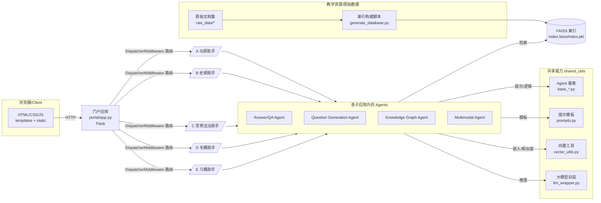
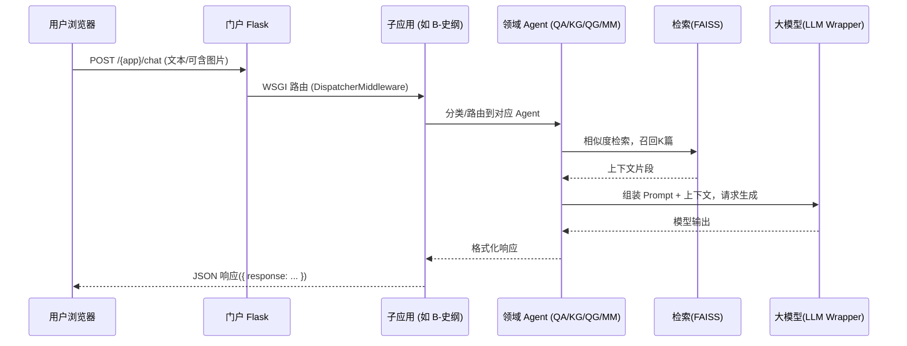

## 技术架构总览

本项目由一个门户应用聚合多个学科助手子应用（Flask），并共享一套通用 Agent 能力（检索、知识图谱、对话、多模态）。各子应用通过 `DispatcherMiddleware` 挂载到统一的进程中对外服务。

### 技术栈
- **后端**: Flask + Werkzeug DispatcherMiddleware, python-dotenv
- **前端**: Jinja2 模板（`templates/`）、静态资源（`static/`）
- **向量检索**: FAISS（由各子应用 `generate_database.py` 预构建 `index.faiss/index.pkl`）
- **大模型封装**: `shared_utils/llm_wrapper.py`（支持 DashScope/OpenAI 等，通过环境变量配置）
- **Agent 基座**: `shared_utils` 下的通用基类与工具（`base_agent.py`, `base_retrieval_agent.py`, `base_kg_agent.py`, `base_dialogue_agent.py`, `vector_utils.py`, `prompts.py`）

### 组件架构图

### 典型请求时序

### 目录与职责映射（关键）
- `启真问智项目汇总/portal/app.py`: 门户应用，负责加载 `.env`、装配各子应用并暴露统一入口 `/`，健康检查 `/healthz`。
- `A.../ B.../ C.../ D.../ E.../app.py`: 各学科助手的 Flask 子应用，提供路由，如 `/chat`、`/chat_ui`、`/` 等。
- `A.../ B.../ C.../ D.../ E.../generate_database.py`: 从 `*_raw_data/` 构建 FAISS 索引（`index.faiss/index.pkl`）。
- `shared_utils/*`: 复用的 Agent 抽象、向量工具、提示模板与大模型封装。

### 配置与运行要点
- 通过环境变量（`.env`）配置模型 Key 等，如 `DASHSCOPE_API_KEY`。
- 子应用可独立运行（各自端口），亦可通过门户统一挂载。
- 图片输入（如 B-史纲）会进行大小/分辨率校验，必要时走多模态处理（Agent 实现 `process_multimodal_request`）。

### 后续可扩展性
- 新增学科助手：复制子应用骨架，复用 `shared_utils`，补充数据与索引。
- 模型/向量化替换：在 `llm_wrapper.py` 与 `vector_utils.py` 内统一替换适配。

